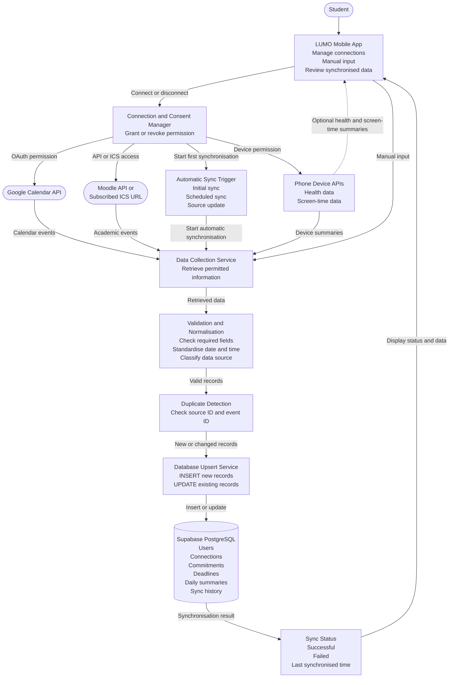

```mermaid
flowchart TD
    Student([Student]) --> App["LUMO Mobile App<br/>Manage connections<br/>Manual input<br/>Review synchronised data"]

    App -->|Connect or disconnect| Consent["Connection and Consent Manager<br/>Grant or revoke permission"]

    Consent -->|OAuth permission| Calendar(["Google Calendar API"])
    Consent -->|API or ICS access| Moodle(["Moodle API or<br/>Subscribed ICS URL"])
    Consent -->|Start first synchronisation| Trigger["Automatic Sync Trigger<br/>Initial sync<br/>Scheduled sync<br/>Source update"]
    Consent -->|Device permission| Phone["Phone Device APIs<br/>Health data<br/>Screen-time data"]

    Calendar -->|Calendar events| Collection["Data Collection Service<br/>Retrieve permitted information"]
    Moodle -->|Academic events| Collection
    Trigger -->|Start automatic synchronisation| Collection
    Phone -->|Device summaries| Collection
    App -->|Manual input| Collection

    Collection -->|Retrieved data| Validation["Validation and Normalisation<br/>Check required fields<br/>Standardise date and time<br/>Classify data source"]

    Validation -->|Valid records| Duplicate["Duplicate Detection<br/>Check source ID and event ID"]

    Duplicate -->|New or changed records| Upsert["Database Upsert Service<br/>INSERT new records<br/>UPDATE existing records"]

    Upsert -->|Insert or update| Database[("Supabase PostgreSQL<br/>Users<br/>Connections<br/>Commitments<br/>Deadlines<br/>Daily summaries<br/>Sync history")]

    Database -->|Synchronisation result| Status["Sync Status<br/>Successful<br/>Failed<br/>Last synchronised time"]

    Status -->|Display status and data| App
    Phone -.->|Optional health and screen-time summaries| App
```
