# LUMO by Vortex

> **Stress & Workload Manager for university students**

**Team:** Aun Yi Qi, Khaw Kai Qing, Keoh Xuan Yun, Anas Ahmed Hassan

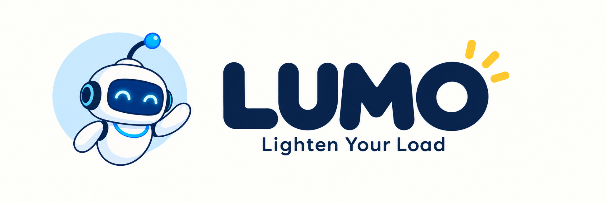

<!-- TODO: Replace these placeholders with the final public links. -->
- **Video presentation:** `[Unlisted YouTube link]`
- **Presentation slides:** `[Public link]`
- **UI prototype:** `[Public link]`

## 1. Project Overview

### The problem

University students are rarely overwhelmed by one responsibility alone. Assignments, examinations, classes, part-time work, social commitments, errands, and recovery all compete for the same limited time and energy.

A calendar can show when activities occur, but it does not necessarily reveal whether the total plan is realistic, which area is creating pressure, or what the student can safely change. Students may respond to an overloaded week by postponing less urgent tasks, sacrificing rest, or accepting additional commitments without understanding the consequences. By the time they recognise the problem, deadlines may already be close and there may be too little flexible time left to recover the plan.

Supporting evidence:

1. In the US Fall 2024 National College Health Assessment, 30% of surveyed students reported that anxiety negatively affected their academics (ACHA, 2025).
2. In UNT Health's 2024 assessment, 39.8% of respondents reported that procrastination negatively affected their academic performance, alongside stress (32.1%) and sleep difficulties (18.2%) (UNT Health, n.d.).
3. A systematic review associates poor sleep with reduced motivation and weaker self-regulation, while digital multitasking and technostress are linked to distraction and disengagement (Ayesha, 2026).

These findings inform LUMO's focus: connecting awareness of mental, time, physical, social, and errand-related load with realistic action. Students need support not only to see what they are carrying, but also to decide what to prioritise, break down, move, or reduce while protecting recovery and fixed responsibilities.

### Target users and stakeholders

- **Primary users:** University students balancing academic and non-academic responsibilities, including study, part-time work, clubs, family responsibilities, and regular errands.
- **Secondary stakeholders:** Lecturers, academic advisers, employers or supervisors, trusted friends or family members, and university wellbeing services.
- **Student control:** Private check-ins, schedules, and AI conversations are not shared unless the student explicitly chooses to share selected information.

### Existing solutions and the gap

Existing tools address parts of the problem, but LUMO connects workload understanding, practical assistance, feasibility-aware rebalancing, and recovery within one workflow.

| Application | Existing strengths | What LUMO adds |
| --- | --- | --- |
| Reclaim | Automatic scheduling, calendar rebalancing, and protected breaks | Student-specific assistance informed by optional workload patterns, with guided recovery and follow-up |
| MyStudyLife | Academic organisation, AI weekly planning, and revision plans | Planning that includes work, social, physical, and everyday commitments |
| Bearable | Wellbeing tracking and insights into mood, sleep, and energy | Optional wellbeing context used for planning and recovery support without treating it as a clinical diagnosis |
| Motion AI | Task and priority-based scheduling | Workload understanding, feasibility checks, protected recovery, and student approval |

**LUMO's difference:**

`Understand -> Assist -> Check Feasibility -> Student Approves -> Recover -> Learn`

### Our solution

LUMO is an AI-powered workload and recovery companion designed for university students. With permission, it combines academic deadlines, commitments, optional wellbeing context, and personal workload patterns to explain what is contributing to a student's current load.

Its main feature, **Lighten My Load**, identifies the student's obstacle, provides relevant assistance, and proposes realistic adjustments checked against deadlines, available capacity, and protected commitments. Students remain in control of every proposed change, while recovery and follow-up feedback support continued rebalancing.

### Core feature set

| Feature | What LUMO does |
| --- | --- |
| **Understand My Load** | Shows where the student's current load is coming from using approved commitments and optional wellbeing context. |
| **Lighten My Load** | Identifies the student's obstacle and provides targeted support such as task breakdowns, revision plans, and realistic schedule adjustments. |
| **Feasibility Gate** | Checks proposed changes against deadlines, available capacity, fixed commitments, and protected recovery; flags when no realistic rearrangement exists. |
| **Before You Say Yes** | Previews how a new commitment could affect existing workload and recovery before the student accepts it. |
| **Recover & Re-check** | Protects recovery time, recommends suitable recovery activities, and uses follow-up feedback to improve future support. |

## 2. Ideation and Process

### Ideas considered

We explored ideas across workload visibility, personal context, practical assistance, realistic rebalancing, and recovery. **Lighten My Load** emerged as the main feature, while complementary ideas were incorporated, simplified, or set aside to keep LUMO focused and feasible.

| Idea | Decision | Reason |
| --- | --- | --- |
| Lighten My Load Agent | Chosen - main feature | Connects student obstacles with practical assistance and feasible, student-approved adjustments. |
| Recovery-First Planner & Guided Recovery | Chosen - core feature | Protects recovery time and provides supportive activities with follow-up. |
| Smart Load Visualiser | Kept | Makes competing demands and scheduling pressure visible. |
| Wellbeing Check-In Companion | Kept | Adds optional student-reported context beyond scheduled commitments. |
| Personal Pattern Learning | Incorporated | Personalises support around meaningful changes in usual workload patterns. |
| Assignment Task Assistant | Incorporated | Breaks difficult assignments into manageable steps. |
| Study Helper | Incorporated | Uses AI and authorised learning resources to explain difficult topics, retrieve relevant course content, and support study planning. |
| Before You Say Yes Preview | Incorporated | Shows how a new commitment could affect existing responsibilities and protected recovery. |
| Enough for Today Assignment Reviewer | Not selected | Could provide misleading reassurance about assignment completeness. |
| Nearby Matching | Not selected | Adds matching and messaging beyond the prototype's core scope. |

### Ideation boards

<!-- The three ideation-board assets are included below. -->

#### Figure 1. Problem Exploration Mindmap

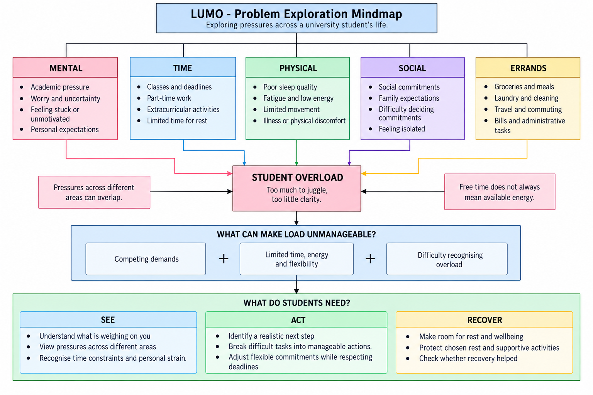

Explores pressures across mental, time, physical, social, and errand-related areas, revealing three recurring needs: see the load, take realistic action, and protect recovery.

#### Figure 2. Problem Tree

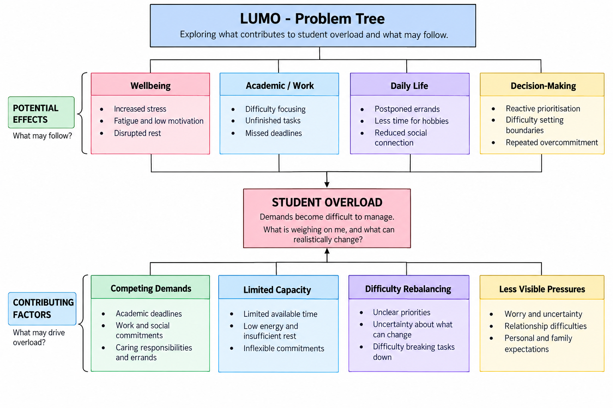

Maps the contributing factors and potential effects of student overload, helping identify competing demands, limited capacity, difficulty rebalancing, and less visible pressures as key areas for intervention.

#### Figure 3. Idea Evolution

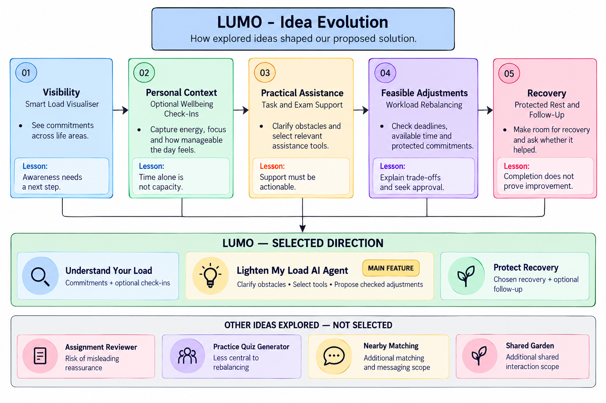

Shows how the initial ideas evolved from workload visibility and optional personal context towards practical assistance, feasibility-aware adjustments, and recovery, resulting in Lighten My Load as LUMO's main AI-agent feature.

### Mentor consultation

| Consultation | Feedback received | What changed |
| --- | --- | --- |
| 6 September 2026 Sim Hong Bing | <ul><li>Add supporting data and competitor research.</li><li>Deepen the role of AI in the standout feature.</li><li>Focus on one main feature.</li><li>Simplify the pitch and emphasise benefits.</li></ul> | <ul><li>Added supporting evidence and compared LUMO with existing solutions.</li><li>Developed Lighten My Load into an AI agent that clarifies obstacles, selects relevant assistance, and checks proposed changes against deadlines, available capacity, and protected commitments.</li><li>Prioritised Lighten My Load, supported by load understanding and recovery.</li><li>Restructured the pitch around the solution and its key benefits.</li></ul> |

## 3. Design and Prototype

LUMO is designed as a mobile-first experience that helps students understand their workload and take action without adding more complexity to their day. The prototype demonstrates the core journey from understanding current load, to receiving AI assistance, to reviewing feasible adjustments, to protecting recovery.

### Core user flow

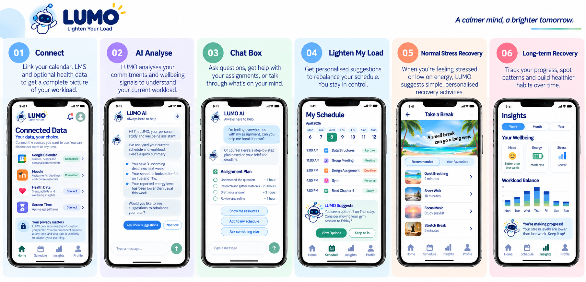

The six key interactions are:

`Connect -> AI Analyse -> AI Assistance -> Lighten My Load -> Recovery Support -> Progress Insights`

Students can connect permission-based data sources, understand their current workload through AI analysis, receive practical assistance for assignments, review personalised schedule adjustments, choose suitable recovery activities, and track their wellbeing and workload patterns over time. Students remain in control of their connected data and any suggested changes.

### Key prototype screens

#### Home - Understand My Load

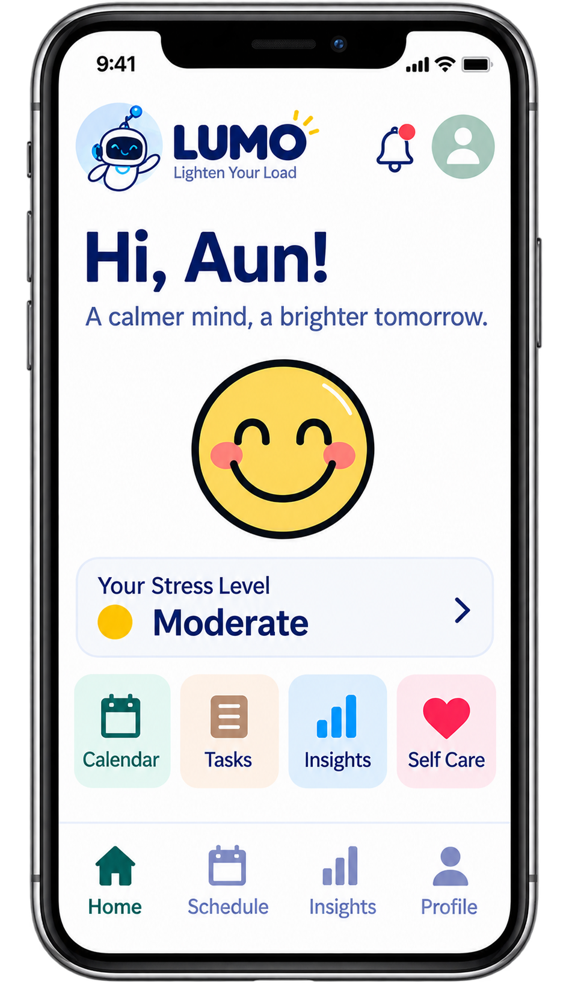

Provides an at-a-glance view of the student's current status, with quick access to their calendar, tasks, insights, and self-care features.

#### Connect Your Data

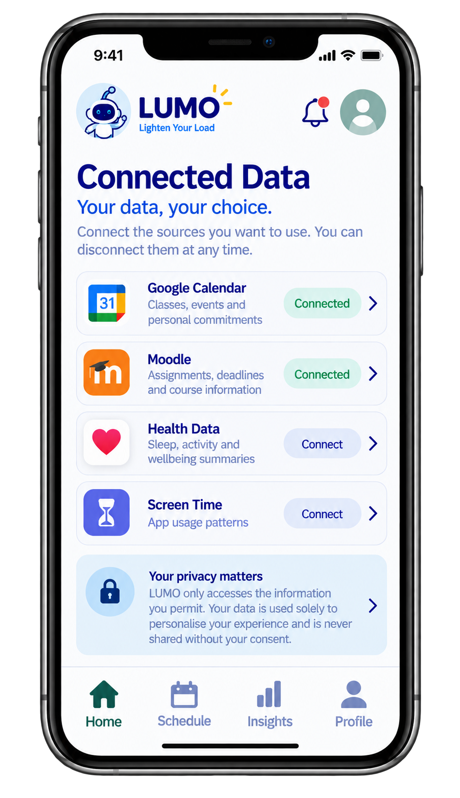

Connects calendars, learning platforms, and optional device data with permission. Students can disconnect sources at any time.

#### LUMO AI Agent

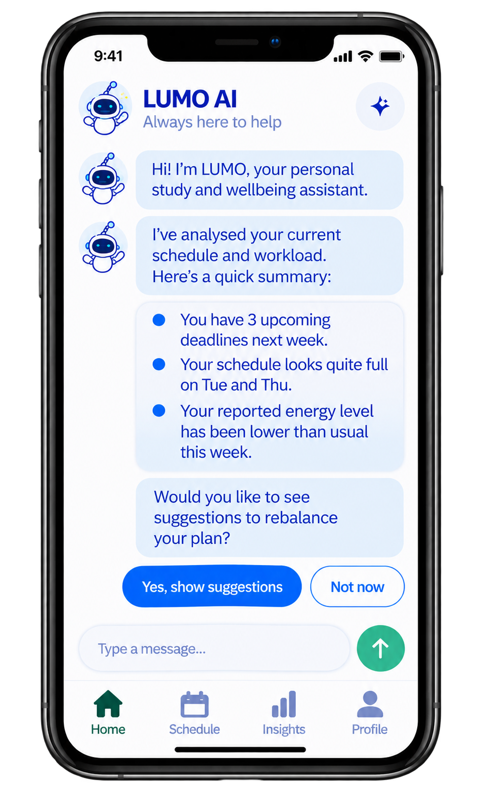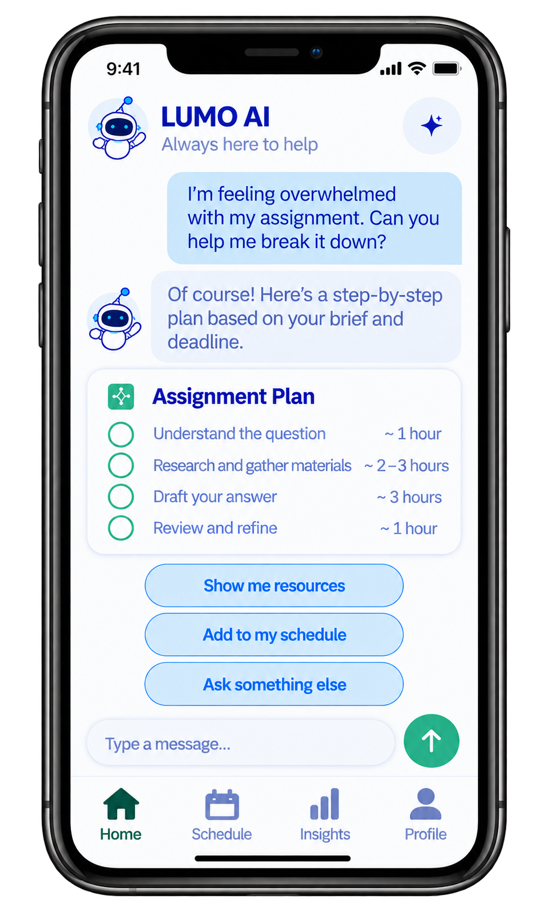

Lets students ask for help when stuck. LUMO understands the situation and suggests personalised, practical next steps.

#### Agent-Assisted Planning

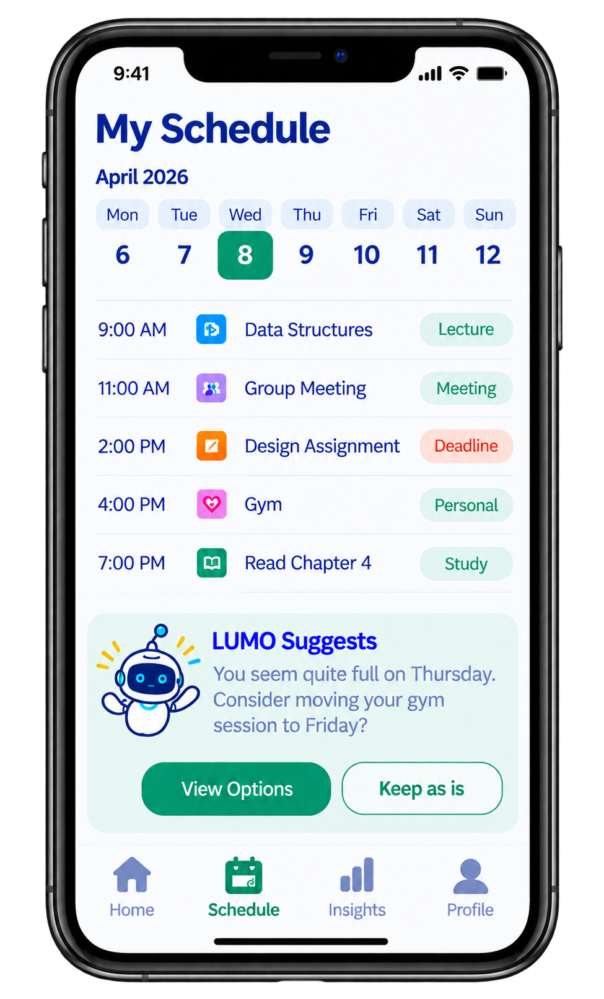

Identifies scheduling pressure and proposes feasible adjustments. Changes are previewed and applied only with the student's approval.

#### Gentle Recovery

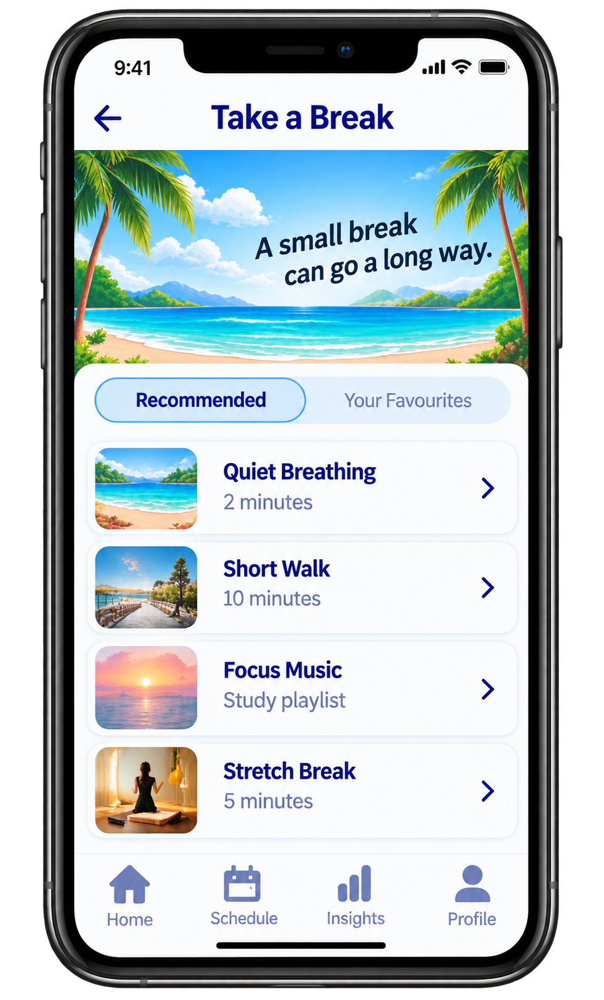

For moderate-pressure moments, students can choose a short calming activity such as breathing, peaceful sounds, or mindful reflection.

#### Workload Insights

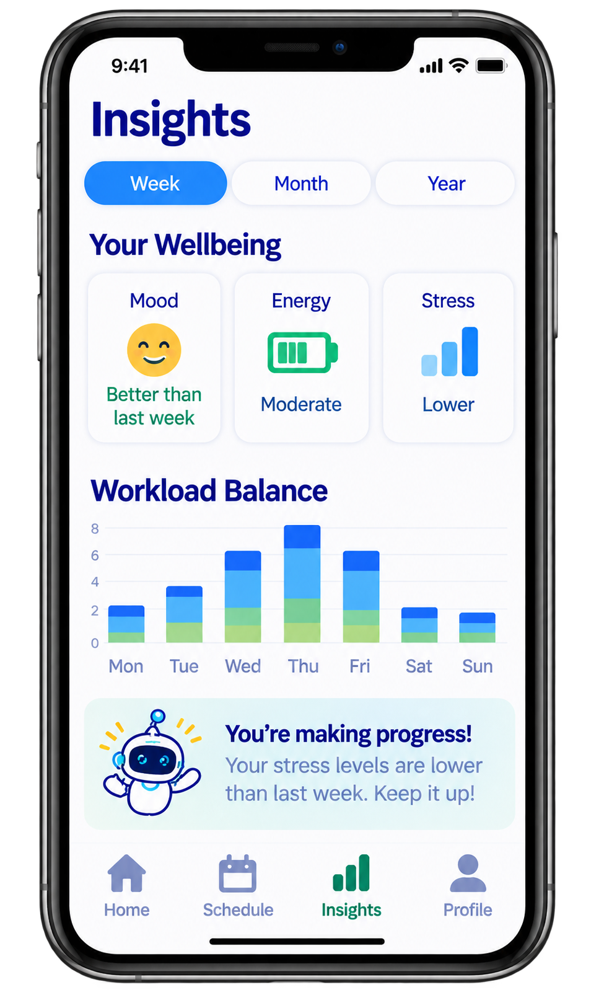

Shows how workload and wellbeing signals change over time, helping students recognise patterns and better understand their current load.

### Design principles

LUMO's interface is designed around three principles:

1. **Clarity:** Important information is presented through simple workload indicators, familiar navigation, and concise recommendations.
2. **Student control:** Proposed changes remain under the student's control and are applied only after approval.
3. **Low-friction interaction:** Consistent layouts, readable text, and clear visual hierarchy support an accessible mobile experience.

## 4. What Makes It Different

Unlike tools that primarily track wellbeing, organise tasks, or automatically rearrange calendars, LUMO connects workload understanding, AI assistance, and feasibility-aware planning to turn awareness into realistic, student-approved action.

### Lighten My Load - main AI agent

- **Personalises through patterns:** Uses approved commitments, optional wellbeing context, and feedback to recognise meaningful changes from the student's usual workload patterns.
- **Finds a workable next step:** Clarifies what the student is struggling with and provides relevant assistance, such as assignment breakdowns, exam-preparation plans, or communication drafts.
- **Checks before changing:** Tests proposed adjustments against deadlines, available capacity, fixed commitments, and protected recovery. If everything cannot realistically fit, LUMO explains the shortfall instead of forcing a schedule.
- **Previews before committing:** Before You Say Yes shows how a new commitment could affect existing workload and recovery before the student accepts it.
- **Keeps students in control:** Explains trade-offs and applies changes only after student approval, while feedback helps personalise future recommendations.

`Understand -> Assist -> Check Feasibility -> Student Approves -> Recover -> Learn`

## 5. Technical Architecture and Feasibility

LUMO uses a lightweight Android mobile architecture that separates AI assistance from deterministic planning checks. AI understands the student's context and suggests actions, while deadlines, capacity, conflicts, and protected commitments are validated before any schedule change is presented for approval.

### Tech stack

| Layer | Technology | Purpose |
| --- | --- | --- |
| Frontend | Flutter (Dart) | Android mobile application interface for LUMO. |
| Database | Supabase (PostgreSQL) | Stores user profiles, tasks, commitments, workload data, and feedback. |
| Authentication | Supabase Auth | Secure sign-in and account management. |
| Backend | Supabase Edge Functions | Handles secure server-side logic and external API requests. |
| AI | OpenAI API | Supports workload-context understanding and task-specific assistance. |
| Planning logic | Dart / Edge Functions | Checks deadlines, available capacity, conflicts, and protected commitments. |
| External Data Integration | Calendar / LMS / optional device data | Provides workload context with student permission. |
| App Build & Distribution | Flutter Android / APK | Builds the LUMO prototype as an Android application for testing and demonstration. |
| Backend Hosting | Supabase | Hosts the database, authentication and backend services. |

### Why this stack?

| Technology | Why chosen | Expected constraints / mitigation |
| --- | --- | --- |
| Flutter | Enables rapid cross-platform development from a single codebase. | Some device integrations and permissions differ across platforms; the prototype focuses on Android. |
| Supabase | Combines PostgreSQL, authentication, and server-side functions in one platform, reducing backend setup. | Free-tier usage and resource limits apply; this is sufficient for prototype-scale usage but may require a paid tier if scaled. |
| Supabase Edge Functions | Provides secure server-side processing without maintaining a separate backend server. | External API calls add network latency, but keep sensitive API keys server-side rather than exposing them in the app. |
| OpenAI API | Provides context-aware AI capabilities for the Lighten My Load agent. | API usage is paid and responses may have latency or variability; deterministic planning rules are used for feasibility checks rather than relying solely on AI. |
| Google Calendar API / LMS API | Reduces manual input by retrieving relevant academic and scheduling information. | Requires user permission, while LMS/API availability may depend on institutional access. Controlled sample data can be used where access is unavailable. |
| Optional Device Data | Provides additional context from permitted device data where available. | Availability depends on device capabilities, platform permissions, and accessible APIs; this integration remains optional. |

### System architecture

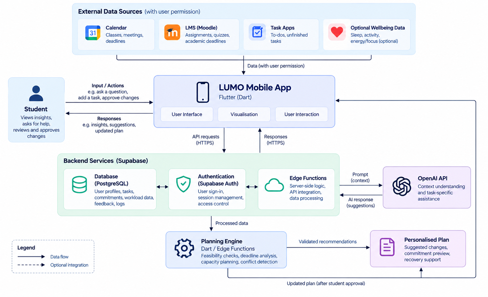

The image above is the polished architecture diagram from the submission PDF. The Mermaid diagram below provides a text-friendly version.

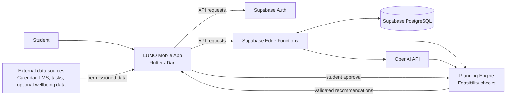

The architecture keeps AI assistance, planning logic, and student approval separate. External data provides context with student permission, while the AI agent generates relevant assistance and the planning engine validates proposed adjustments against deadlines, available capacity, and conflicts. Changes are presented to the student for review and are only applied after approval.

### Build plan and scope

The initial build prioritises a complete end-to-end LUMO Android application, with external integrations and advanced personalisation implemented according to available API access and Android permissions.

| Build area | Prototype deliverable |
| --- | --- |
| Connection | Permission-based input of tasks, deadlines, commitments, and optional wellbeing context, using connected sources where available and controlled sample data where access is restricted. |
| AI Analyse | Workload analysis that identifies approaching deadlines, limited available time, schedule conflicts, and meaningful changes from usual patterns. |
| LUMO AI Agent | Conversational assistance that explains contributing factors, clarifies the student's obstacle, and provides next steps such as task breakdowns, study plans, or communication drafts. |
| Lighten My Load | Feasible workload and schedule adjustments based on flexible commitments, deadlines, available capacity, and protected recovery time. |
| Student Approval | Review interface showing proposed changes and trade-offs before any schedule adjustment is applied. |
| Before You Say Yes | Commitment preview showing how a new activity could affect existing workload, available capacity, and recovery time. |
| Guided Recovery | Short recovery activities that students can choose when they need time to reset, with optional follow-up feedback. |
| Step Outside | Outdoor recovery option that encourages a short break away from the screen and supports optional activity progress. |
| Re-check | Updated workload view and optional follow-up feedback after rebalancing or recovery to inform future recommendations. |

**Build order:** `Connect -> Analyse -> Assist -> Rebalance -> Approve -> Recover -> Re-check`

### Resource and time requirements

LUMO is designed to be developed by a small development team using managed cloud services and existing APIs. The main resources required are development time, technical expertise, development tools, cloud services, and devices for testing.

| Resource | Requirement |
| --- | --- |
| Team | Four members working in parallel across frontend development, backend and database, AI and planning logic, integration, and testing. |
| Technical skills | Mobile application development, backend and database development, AI and API integration, planning logic, UI/UX design, and application testing. |
| Software and services | Flutter SDK, Git and GitHub, Supabase, OpenAI API, and relevant external APIs for connected data. |
| Hardware | Existing laptops for coding and development, and smartphones for testing the mobile application and device-based features. |
| Cost | Low overall development cost, with most tools and services available through free tiers for prototyping. The main expected expense is usage-based OpenAI API access; additional cloud or external API costs may apply if free-tier limits are exceeded. |

### Development plan

| Week | Focus | Planned development |
| --- | --- | --- |
| Week 1 | Foundation and workload analysis | Set up the application, database, and authentication; implement workload input, core UI, and workload analysis. |
| Week 2 | AI agent and rebalancing | Develop Lighten My Load, AI chat, feasibility checking, schedule rebalancing, student approval, and Before You Say Yes. |
| Week 3 | Recovery and final integration | Complete recovery, reassessment, and feedback features; integrate available data sources; conduct testing, bug fixing, and deployment. |

### Automatic data synchronisation

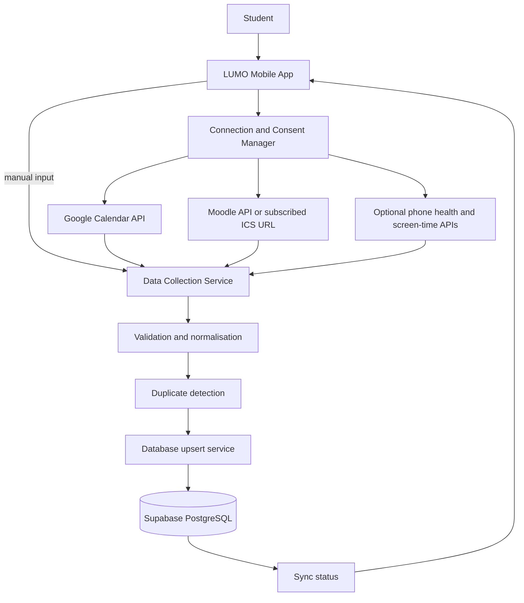

The flow begins when a student connects or disconnects an information source. LUMO obtains the required authorisation, retrieves permitted information, validates and normalises records, detects duplicates using source and event IDs, and inserts or updates records in Supabase PostgreSQL. Sync status and the last update time are then shown in the mobile application.

### AI workload analysis

LUMO does not assume that a high workload automatically indicates stress. AI checks work time compared with available time, approaching deadlines, schedule conflicts, changes in sleep and activity, unusually high screen time, and optional stress or energy checks. It compares these metrics with a student's normal patterns, converts them into scores, and combines them using transparent weightings.

Results are classified as **stable**, **rising**, or **high risk**, while showing the main influencing factors and confidence levels. If there is insufficient data, LUMO asks for confirmation rather than guessing. The result is a stress-risk assessment, not a medical diagnosis.

### AI agent architecture

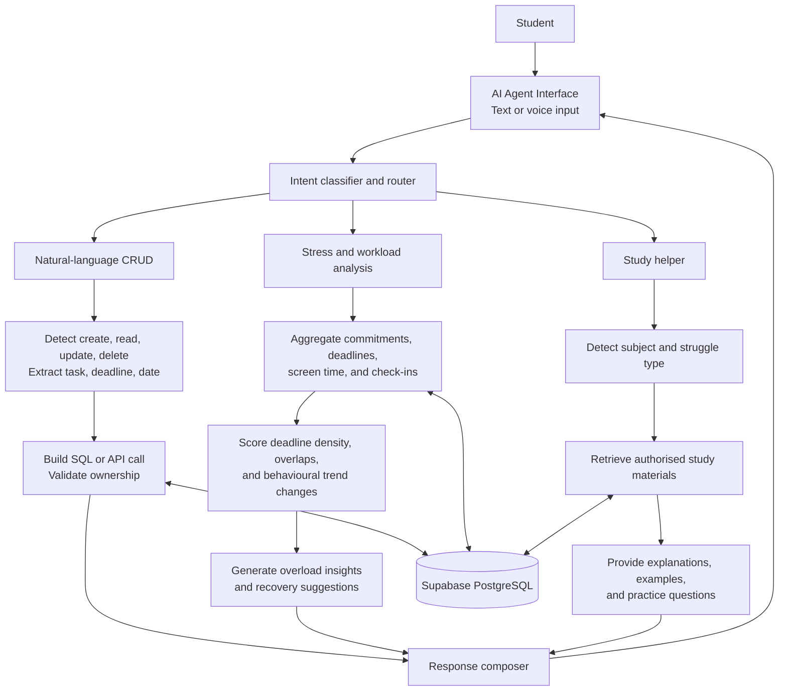

LUMO's AI agent works as one connected system with three functions branching from a single router:

- **Natural-language CRUD:** Lets students create, read, update, or delete their own records by typing naturally.
- **Stress and workload analysis:** Gathers signals such as deadlines, sleep, screen time, and schedule conflicts; compares them with the student's normal patterns; scores them transparently; and classifies the result as stable, rising, or high risk with a confidence level. If the data is too thin, LUMO asks for confirmation rather than guessing, making this a risk assessment rather than a diagnosis.
- **Study helper:** Detects when stress comes from an academic struggle, retrieves relevant course material, and provides a step-by-step explanation.

All three functions share the same database and feed into one shared response, so insights from one function can inform the others over time.

## 6. Scope Boundaries and Future Extensions

### In scope and out of scope

| In scope | Out of scope |
| --- | --- |
| Student workload and schedule planning | Mental-health diagnosis |
| Lighten My Load AI agent | Therapy or medical treatment |
| AI-suggested task and schedule adjustments | Automatically changing schedules without approval |
| Assignment breakdown and study support | Completing assessed work for students |
| Optional wellbeing check-ins | Making decisions solely from health or wellbeing data |
| Personalisation from patterns and feedback | Emergency or crisis intervention |
| Recovery suggestions and protected recovery time | Accessing personal data without consent |
| Permission-based connected data |  |

### Future extensions

Future versions can add live Moodle integration, automatic calendar synchronisation, deeper Health Connect integration, device-usage analysis, longer-term personal pattern learning, and wider university deployment.

### Core prototype flow

`UNDERSTAND -> ASSIST -> CHECK FEASIBILITY -> APPROVE -> RECOVER -> LEARN`

## 7. References

- American College Health Association. (2025). *Fall 2024 National College Health Assessment reports are here!* [https://www.acha.org/news/fall-2024-national-college-health-assessment-reports-are-here/](https://www.acha.org/news/fall-2024-national-college-health-assessment-reports-are-here/)
- Ayesha, A. (2026). The interconnected roles of sleep, stress, and technology use in student motivation and academic engagement in higher education: A systematic review (2015-2025). *Frontiers in Education, 11*, 1889391. [https://doi.org/10.3389/feduc.2026.1889391](https://doi.org/10.3389/feduc.2026.1889391)
- University of North Texas Health. (n.d.). *ACHA-National College Health Assessment III (NCHA).* [https://www.unthealth.edu/students/care-and-civility/national-college-health-assessment-iii-2024.html](https://www.unthealth.edu/students/care-and-civility/national-college-health-assessment-iii-2024.html)
